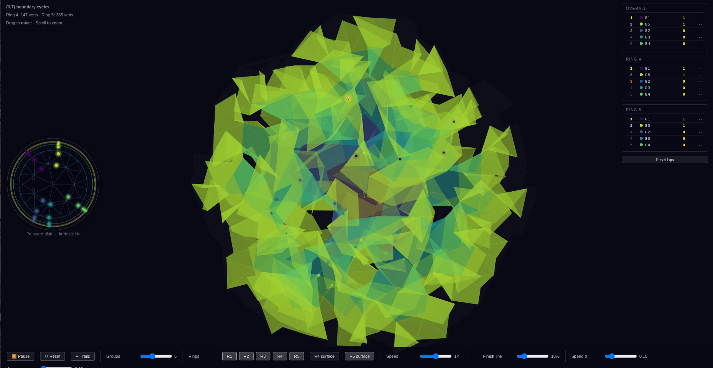

# 237

The curvature trichotomy in mathematics connects a wide-ranging collection of ideas. The simplest case comes from 2-D geometry, where a surface can have positive curvature like a sphere, zero curvature like a Euclidean plane, or negative curvature like a saddle. By considering structures associated to these geometric objects, the trichotomy reveals facts and illustrative examples not only in geometry but also in algebra, number theory, analysis, mathematical physics, and beyond.

One aspect of the trichotomy that manifests in many contexts is visible when considering the three example surfaces of sphere, flat plane, saddle. The sphere is compact and finite in area. The flat plane is potentially infinite in extent, but it can be conveniently described by a well-behaved coordinate system. The saddle is another potentially infinite surface, and coordinate systems are more complicated. Answers to numerical questions posed of structures sorted into this trichotomy often come back with answers that are either explicitly "none", "finitely many" and "infinitely many" or can be rephrased as such.

This project investigates a structure that is minimal among an interesting category of discrete symmetric structures in the negative curvature sector of the trichotomy. The minimality is interesting because it distinguishes this structure among an infinite variety. Its simplest illustration consists of congruent equilateral triangles, joined edge to edge, with seven meeting at every vertex. I call this the {3,7} hyperbolic tiling.

## Background

The densest tiling of the hyperbolic plane is a natural place to begin investigating this structure. Another wonderful example is the algebraic curve known as Klein's Quartic. Building physical models led me to a question: a physical model of a periodic tiling of the hyperbolic plane, like [this one](https://publicartarchive.org/art/Hyperbolic-Immersion/005697b6), will always run up against the fact that an exponentially growing area (the area of a hyperbolic disk grows exponentially in its radius) must fit in a volume that only grows cubically. This is almost certainly a reflection of a mathematical restriction. I assert that the rigidity of the model means there exists an N such that it is impossible to embed the surface consisting of all triangles within distance N from a given central triangle. I say almost certainly because a *continuous* embedding of the hyperbolic plane in R³ can be done. But if N > 5, it would be very surprising.

For building intuition about this tiling, you might try playing [HyperRogue](https://en.wikipedia.org/wiki/HyperRogue) ([Steam](https://store.steampowered.com/app/342610/HyperRogue/)).

## The embedding question

The central question is: what is the maximum number of rings of equilateral triangles that can be embedded in R³ following the {3,7} pattern without self-intersection?

Computational experiments using a physics-based relaxer (spring forces between vertices, repulsion between non-adjacent faces) suggest the answer is **N = 5**. Across 500 independent trials:

- Rings 1–3 embed with edge standard deviation ≈ 0.000 (essentially perfect equilateral triangles)
- Ring 4 embeds with edge std ≈ 0.005
- Ring 5 embeds in 34.6% of trials, with edge std ≈ 0.047
- Ring 6 collides in 100% of trials

A proof sketch for the existence of a finite N, with a conjectured N = 5 is under development, based on:

- Physical realization with ε-thick tiles, where the volume constraint becomes active
- A **snapping** mechanism: when two vertices come within ε with compatible edge directions, they merge, inheriting all edges from both — potentially triggering a cascade of further snaps. This is to deal with potential embeddings with near-foliated regions.
- The cascade is constrained combinatorially and algebraically. For example, Coxeter group structures related to the hyperbolic triangle group Δ(2,3,7) are incompatible with Euclidean symmetries.
- All structures satisfying the algebraic/combinatiorial constraint develop a contradiction as N increases and this contradiction persists as ε → 0.

## The lattice connection

Gluing icosahedra together using octahedra as bridges produces a diamond-like lattice living in Z[φ]³ (coordinates with entries of the form a + bφ, where φ is the golden ratio). This leads to further questions:

- Under what rules will these lattices spontaneously emerge from a growing shape?
- Can the lattice structure and representations of Fuchsian groups — in particular PSL(2,7), the minimal algebraic example associates with Klein's Quartic curve — be used to efficiently work with hierarchical data in relatively low dimensions?

## Visualization

The interactive animation `boundary_racing.html` shows points sweeping out the ring boundary cycles.

## Contents

| File | Description |
|------|-------------|
| `boundary_racing.html` | Interactive boundary cycle racing animation |
| `physics_grow.py` | Physics-based ring grower (spring relaxer) |
| `physics_grow_snap.py` | Grower with vertex snapping (ε-merging) |
| `build_library.py` | Generate large trial library with gap statistics |
| `gap_analysis.py` | Batch spherical gap analysis for PLY files |
| `gap_geometry.py` | Detailed azimuthal gap profile analysis |
| `color_disk.py` | Apply Wes Anderson / viridis palettes to vZome disk files |
| `hyperbolic_triangle_gnn.py` | GNN-assisted ring embedder (experimental) |
| `new_journal_entry*.txt` | Session notes and proof development log |
| `lattice_unit_colored.vZome` | Hand-colored {3,7} disk in the icosahedral lattice |
| `disk_extended_*.vZome` | Extended disk files with various palettes (rings 0–17) |

## Related work

- Student work by Daniel Stroh and Cypress Robinson: [github.com/Qwanve/CS495](https://github.com/Qwanve/CS495)
- Claude237, an AI model working with these materials: [claude.ai artifact](https://claude.ai/public/artifacts/6a503d0e-a7e5-48fe-83a2-9d4923e9958b)
